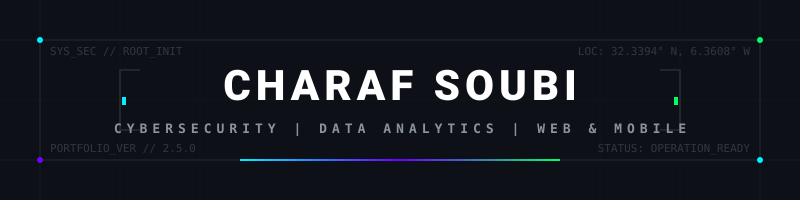
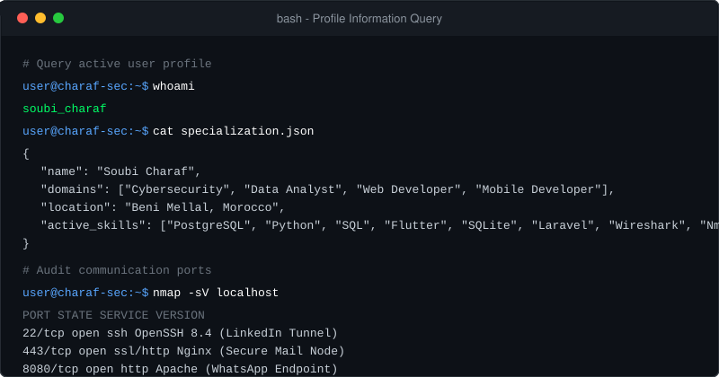
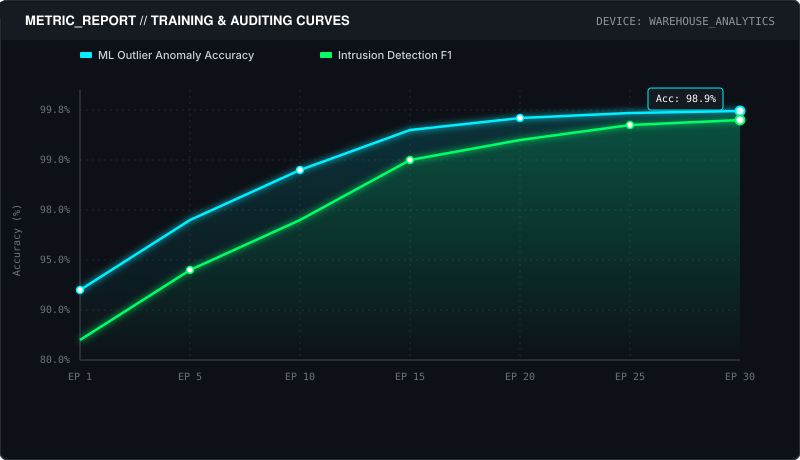
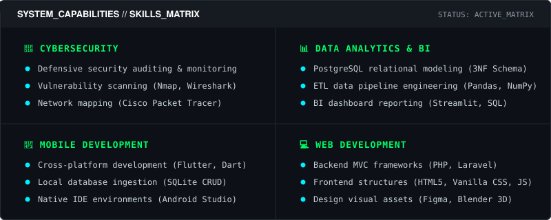
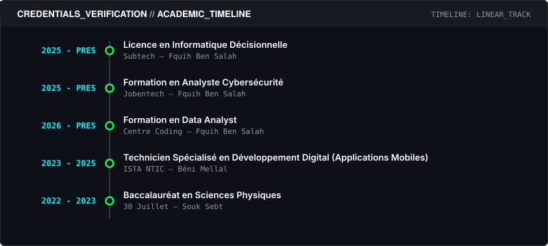
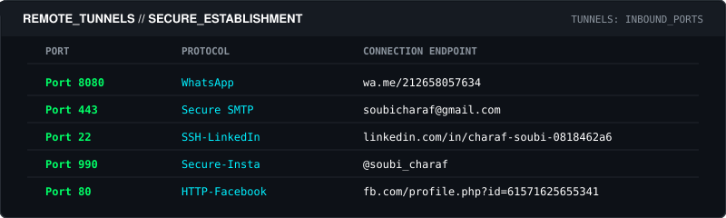

  

<h1 align="center">CHARAF SOUBI</h1>

  

  

A professional software engineer specializing in Defensive Cybersecurity auditing, PostgreSQL relational data warehouses, cross-platform Flutter mobile applications, and secure full-stack web platforms.

 

 

I am Charaf Soubi, a software developer and cybersecurity analyst based in Béni Mellal, Morocco. I hold a TS degree in Digital Development (Mobile Applications) and focus on building secure, database-driven applications. 

My workflow covers the entire software and security lifecycle: from architecting PostgreSQL relational databases and writing data integration scripts, to performing active network threat audits and writing cross-platform frontend interfaces.

 

 

The panels below represent active configurations for my local threat analysis and analytics dashboard training logs.

  

  

 

 

To ensure complete platform visual continuity, my core tech skills are structured inside the matrix panel below.

  

 

 

Here is a summary of my active implementations, categorized by target engineering domain.

### Relational Warehouses & Data Analytics

*   **[Prepaid Card Analytics](https://github.com/charaf12-u/prepaid-card-analytics.git)**: Data classification and anomaly detection script for financial transactions dataset.
*   **[Superstore Pipeline (ETL)](https://github.com/charaf12-u/Superstore-.git)**: Relational parsing pipeline mapping CSV logs into PostgreSQL dimensional 3NF schemas.
*   **[Superstore Dashboard](https://github.com/charaf12-u/superstore-dashbord.git)**: Direct KPI visualization dashboard querying a live PostgreSQL database.
*   **[FinanceCore Postgres](https://github.com/charaf12-u/financecore_postgres_analytics.git)**: Transaction data structure modeling and accounting metric queries.
*   **[Nettoyage Transactions](https://github.com/charaf12-u/Nettoyage_Transactions_Bancaires.git)**: Preprocessing script identifying statistical anomalies in transaction dataset.

### Mobile & Web Software Systems

*   **[Stormaroc Stock Management](https://github.com/charaf12-u/stormaroc-app-.git)**: Multi-device inventory tracking application with local SQLite schemas.
*   **[User Management Pro](https://github.com/charaf12-u/User-Management-app.git)**: Flutter showcase for local DB CRUD controllers and data operations.
*   **[EduRecruit Portal](https://github.com/charaf12-u/EduRecruit-Portal.git)**: Exam scheduling system featuring secure admin dashboards.
*   **[Bike Tours Booking](https://github.com/charaf12-u/BikeTours.git)**: E-commerce booking platform built with MVC PHP architecture.
*   **[Gourmet Burger](https://github.com/charaf12-u/site-web-burger.git)**: Dynamic restaurant interface with direct relational DB tables.

### Blender 3D Simulation Models

*   **[ChainBall Physics](https://github.com/charaf12-u/ChainBall-Physics-Simulation.git)**: 3D physics modeling of rigid body collision trajectories.
*   **[Workspace 3D Module](https://github.com/charaf12-u/3d-module.git)**: interior workspace design using PBR mapping.

 

 

The chronological tracker below details diplomas, professional training paths, and milestones.

  

 

 

Active host addresses configured for incoming network queries and job proposals.

  

  
  
  
  

---

